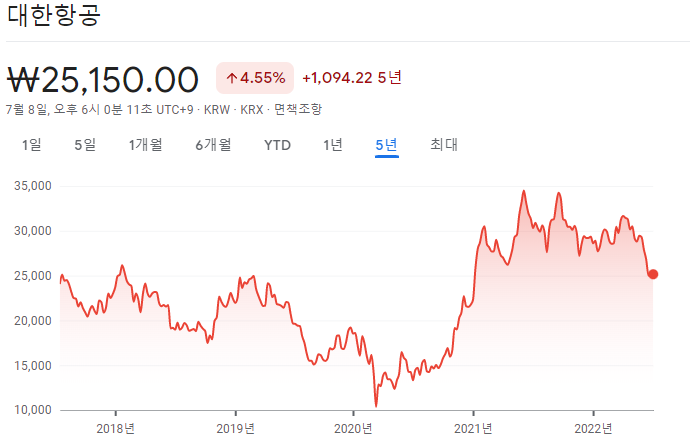

# 국내 주식에 대한 산업분석

## 대한항공
### 1. 왜 대한항공을 주제로 잡았는가?
- 대한항공은 코로나와 오너 리스크로 인한 가치 하락을 겪음
- 최근 코로나가 종식됨에 따라 가치 상승이 기대 됌
- 실제로 코로나 기간 최저가(2021.03.20 당시 10,358원)에 비해 약 41% 상승했음(20222.07.08 종가기준)

### 2. *SWOT* 분석   
1. Strength(강점)
    1. 취항 노선 경쟁력1
        - 국내 항공사 중 독점 운항 중인 원거리 노선을 다수 보유
        - 델타 항공과 미주노선 조인트벤처를 설립해, 한국과 미국 내 다른 노선과의 연결성을 높여 
          *L/F(Load Factor)* 를 상승시킬 수 있는 경쟁력도 갖춤
    2. 장거리 화물 노선1
        - 미주와 구주 노선은 대한항공 화물 매출의 약 70%를 차지함
        - 연간 143만t 을 처리할 수 있는 인천공항 제1화물 터미널과 연간 26만t을 처리할 수 있는 제2화물 터미널을 비롯해 
        미국의 로스앤젤레스와 뉴욕, 일본의 나리타와 오사카 4개 해외 공항에 화물 전용 터미널을 독자적으로 운영  

2. Weakness(약점)
    1. 아시아나 항공 인수
        - 재무안정성이 저하될 위험
        - 일정의 지연
    2. 수익성 회복 지연 가능성
        - 대한항공 매출은 국내/국제 여객 및 화물 운송업을 영위하는 항공운송 부문의 비중이 90% 이상으로 높은 비중을 차지하고 있어, 
        국내외 항공운송 수요에 따라 전체적인 매출 변동 위험이 존재함
        - 대한항공 영업이익률은 2018년 4.48% 에서 2018년 1.42%로 하락하여 수익성이 악화되는 추세. 2020년에는 전년 동기 대비 매출액이 38.58% 감소함.
3. Opportunity(기회)
    1. 항공화물 수요 증가
    2. 여객 수요 증가

4. Threat(위협)
    1. 코로나 19의 재확산
    2. 비용의 증가
        - 환율 상승에 따른 해외 여행 수요 감소
        - 유류세 상승에 따른 항공권 가격 인상      
    3. 항공업계의 경쟁 심화
 
 
 
 ------
 ## 출처
1. https://www.jobkorea.co.kr/starter/companyreport/view?Inside_No=11191&schCtgr=101012
 
 ## 용어 해설
 - SWOT 분석은 강점(strength), 약점(weakness), 기회(opportunity), 위기(threat)의 앞글자를 따서 
    SWOT 분석이라 하며 기업의 강점과 약점, 환경적 기회와 위기를 열거하여 효과적인 기업 경영전략을 수립하기 위한 분석방법이다.
 - L/F(Load Factor): 탑재 가능량에 대해 실제 탑재된 여객 또는 화물의 탑승/탑재율
